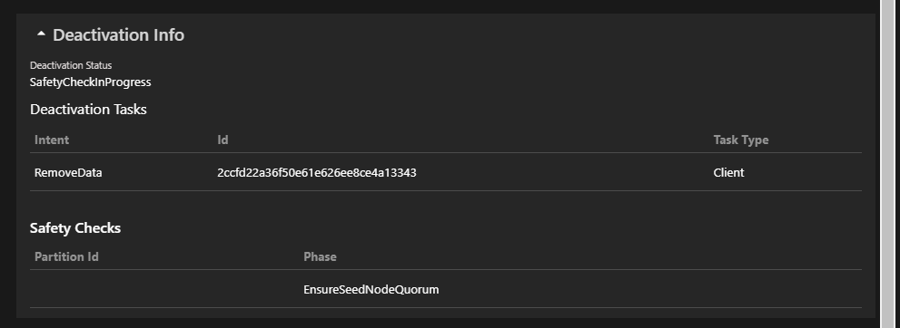

# Seed node is stuck in Disabling with seed node quorom safety check

## Is this the right TSG?

- All VMSS operations are blocked on Silver or higher durability Scaleset.
- Seed node stuck in Disabling state(this can be seen for example through SFX)



## Safe Mitigation Path

NOTE: Mitigation time will take at a minimum 60-90 minutes. Depending on the configuration of SF cluster upgrade settings it can take significantly longer

To unblock Node deletion operation initiated through VMSS and get the cluster back to the desired reliability level, the following are the high level steps

1. Temporarily reduce reliability level to match number of remaining seed nodes after removal of VM
2. Scale out VMSS
3. Set reliability level to the desired level for the cluster

NOTE: For the following mitigation steps, the cluster's currently reliability is assumed to be silver. Change any reference to "Silver" to your reliability and "Bronze" to the reliability below your current one. Please refer to the following for more information on seed node counts to reliability levels https://docs.microsoft.com/en-us/azure/service-fabric/service-fabric-cluster-capacity#the-reliability-characteristics-of-the-cluster 

## Prequisites

* Ensure that the applications are healthy (other than any issues related to the blocked operation)
* Get ARM template for the cluster. (If you created the cluster using portal, go to resource.azure.com and find the resource, select Read/Write mode and click on edit. It is recommended to use ARM templates that are checked in to source control for production environment)

## Mitigation steps

### Step 1: Temporarily reduce reliability level to match number of remaining seed nodes after removal of VM

Find the following line in the ARM template
```
    "reliabilityLevel": "Silver",
```
modify it to
```
    "reliabilityLevel": "Bronze",
```

Redeploy the ARM template (if in resources.azure.com, PUT the changes)


### Observed / Expected behaviors while the change is being applied
* The change will be applied to the cluster and take a while to complete. You can follow progress by opening SFX for the cluster and going to details tab at the cluster level
* Two cluster upgrades will be required.
* After everything is completed, the cluster will have the required number of Seed Nodes for Bronze
* Once the reliability level is changed on the cluster, the VMSS operations initiated should complete. It will take a while to complete.
 

Optional Step: To speed up VMSS operation

* Select one of the VMs in failed state and run Update from the menu. Update menu should also be on the Overview page

### Step 2: Scale out VMSS

### Prerequisite:
When the seed node count matches the requirement for Bronze and all of them are healthy, time to proceed


* Scale up the VMSS to 5(the seed node count required for silver reliability) and wait for nodes to join the SF cluster

If this operation was already tried when deletion was stuck, VMSS will initiate the scaleout and another scaleout is not required

NOTE: It may take a while before VMSS starts the operation

### Step 3: Set reliability level to the desired level for the cluster.

### Prerequisite:
Primary node type has at least the minimum number of VMs for the desired reliability level

* Change the reliability Level to Silver and redeploy the ARM template.

#### Observed / Expected behaviors while the change is being applied

* The change will be applied to the cluster and take a while to complete. You can follow progress by opening SFX for the cluster and going to details tab at the cluster level
* Two cluster upgrades will be required.
* After everything is completed, the cluster will have the required number of Seed Nodes for the Silver


## What was the cause?
SF is blocking deletion of VM to prevent violating configured ReliabilityLevel

* Current delete operation, initiated by the customer through VMSS is trying to reduce the number of allocated nodes below that min number nodes required for reliability level for Primary node type.


Customer has to determine the root cause of why the VM is being deleted

* The VMSS operation that resulted in the specific instance is being deleted / deallocated - Audit logs for VMSS in Portal should have the information
###Most common reasons
* Customer initiated delete / deallocation from portal or CLI
** normally to address some other issue and as a result put the cluster into worse state
* Auto scale settings where min is < number of nodes required for reliability level
* Some automation run by customer that is initiating the delete

NOTE: Deallocate operation on instances in scaleset associated with SF is not supported.